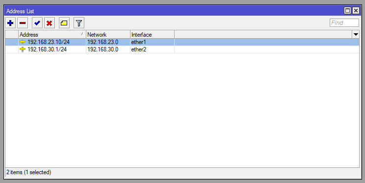
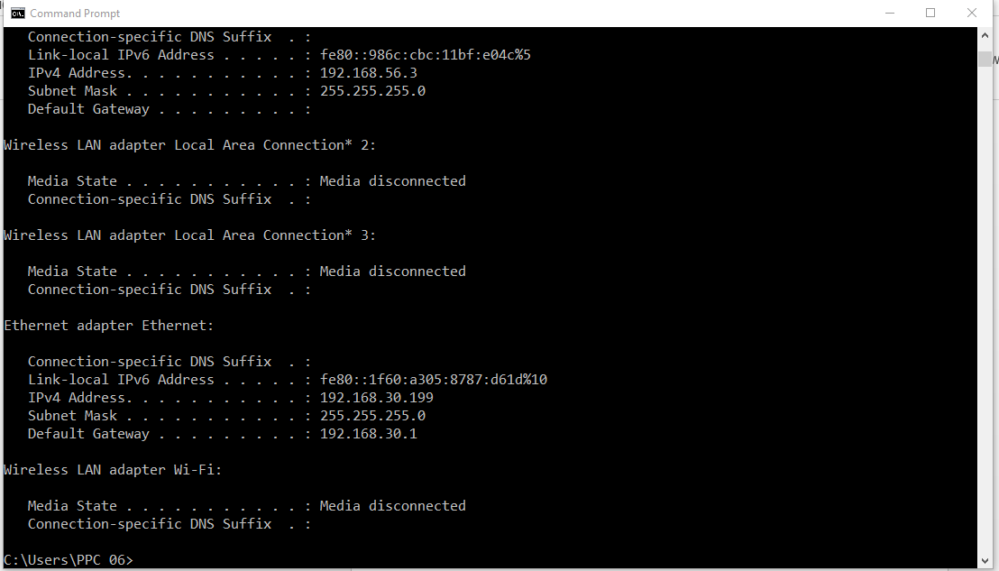
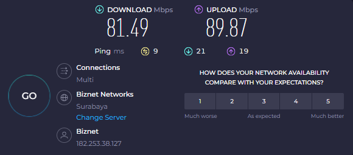
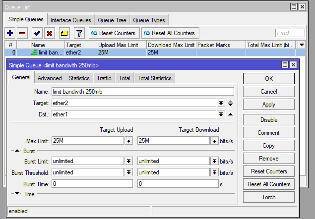
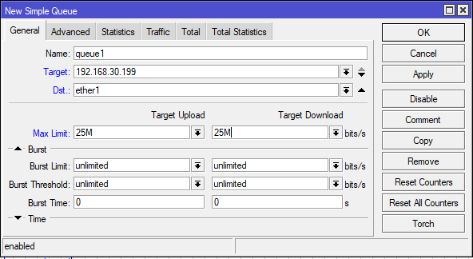
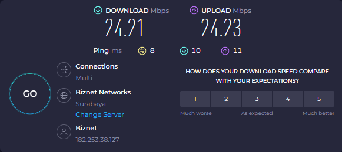

# Mikrotik Limit Bandwidth dengan Simple Queue  
#
Dibuat oleh: ***[Maulana Ifandika]()***  
Youtube: [Ifandika](https://www.youtube.com/@IfandikaChannel)  
Gmail: <maulana.ifandika@gmail.com>  
Linkedin: <https://www.linkedin.com/in/maulana-ifandika>  
3 Desember 2023  
#
> Melakukan limitasi kecepatan Internet dengan Simple Queue pada Mikrotik Router dengan Winbox.
#
#### 1. Konfigurasi IP Address

#### 2. Pengecekan IP yang didapat oleh Klien Jaringan Lokal (ether2)

#### 3. Tes kecepatan Internet yang didapat Klien
> Klien mendapat kecepatan Internet -+ 80Mbps

#### 4. Setingan Limit Simple Queue
> Ke Queue pada Winbox
> 	Queue > [Simple Queue]
> Lalu buat profil baru dengan tanda ( + ), lalu untuk konfigurasi:

- Name 		= limit bandwidth 25mib (Nama profil/setingan)
- Target 	= ether2 (Interface arah Klien)
- Dst.		= ether1 (Interface terhubung ke Internet)
- Target Upload
	- Max Limit 	= 25M (25Mbps)
- Target Download
	- Max Limit 	= 25M (25Mbps)

> Karena pada Target dipilih ether2 maka otomatis semua IP pada Interface ether2 akan terkena limit.

#### 5. Limit Pada IP Tertentu Simple Queue
> Untuk limit pada IP tertentu, cukup masukan range IP/IP klien pada kolom Target.

- Target = 192.168.30.199

> Maka otomatis klien IP 192.168.30.199 akan terkena limit

#### 6. Tes kecepatan klien setelah dilimit

##### *_Sekian terima kasih, semoga bermanfaat_*